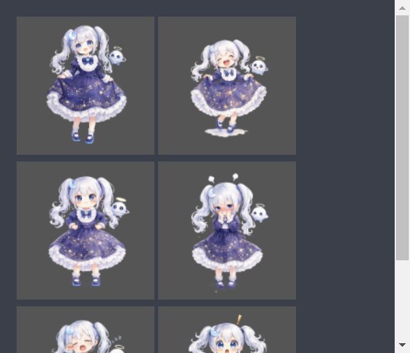
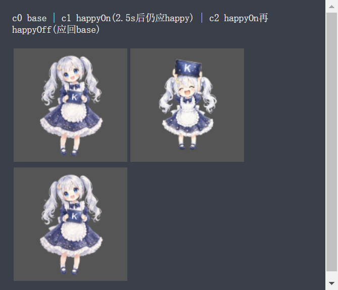
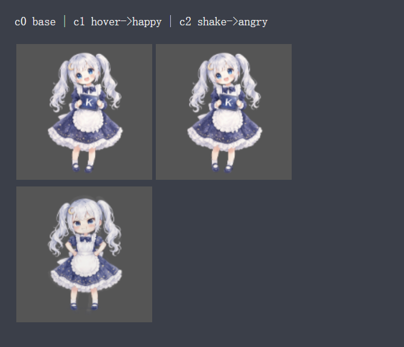

# 小月（Xiaoyue）· Kimi 拟人化桌宠 — Q 版女仆装样式

> Kimi Work 桌面宠物「小月」：Q 版动漫小女孩形象，覆盖 K2.6 / K3 标准 / K3 进阶 / K3 极致四个模型形态，支持表情交互。
>
> **English**: An unofficial chibi-style desktop pet ("Xiaoyue") for Kimi Work, with 4 model forms and interactive expressions. Rive-based.



## 形态

| 模型 | 形态 | 定位 |
|---|---|---|
| K2.6 | `xiaoyue_k26.riv` | 小女孩 |
| K3 标准 | `xiaoyue_k3.riv` | 小女孩（装饰升级） |
| K3 进阶 | `xiaoyue_k3plus.riv` | 小女孩（装饰再升级） |
| K3 极致 | `xiaoyue_k3max.riv` | 小女孩（最华丽装饰） |

四个形态均为大头 Q 版，以服装与装饰区分档位。每形态内置 7 张立绘：基础 / 开心 / 生气 / 惊讶 / 打瞌睡 / 害羞 / 坏笑（备用）。

## 交互逻辑

| 操作 | 反应 | 状态机输入 |
|---|---|---|
| 鼠标移到桌宠身上（不挪开） | 一直保持开心 | `happyOn` / `happyOff` |
| 按住快速来回摇晃 | 生气 | `angry` |
| 待机不管（约 45–90 秒） | 打瞌睡 ↔ 惊讶 交替 | `empty1` / `empty2` |
| 有审批 / 授权待处理 | 害羞 | `shake`（运行时原生触发） |
| 双击 | 生气（备用途径） | `angry` |
| 鼠标移动 | 8 方向注视（本样式默认关闭倾斜，见安装文档） | 8 方向 trigger |




## 仓库结构

```
riv/          四个形态的成品 Rive 文件（可直接安装）
assets/       每形态 7 张立绘 PNG（384px 高、已去水印裁边）
manifest/     四份 pet.json 安装清单
docs/         安装与运行时补丁说明
screenshots/  效果截图
```

## 安装

详见 [docs/INSTALL.md](docs/INSTALL.md)。简要：把对应形态的 `pet.riv` 与 `pet.json` 放入 Kimi Work 桌宠工作区目录，并给 `index.html` 打交互补丁（补丁代码与锚点见安装文档），重启即可。

## 状态机

状态机名：`KimiAvator_homepage`

- 数字输入：`light/dark`（主题，运行时原生）
- 触发器：`right / lower_right / down / lower_left / left / upper_left / up / upper_right`（方向）、`shake`（审批）、`jump` / `angry` / `empty1` / `empty2`（表情动作）、`happyOn` / `happyOff`（悬停持续开心开关）

## 版权与免责声明

- **本项目为非官方同人作品，与 Moonshot AI（月之暗面）没有任何官方关联，未获其背书或授权。**
- 「Kimi」名称及角色原型的相关权利归 **Moonshot AI** 所有；本项目的角色形象为粉丝二次创作。
- 立绘由 AI 生成后经人工处理（去水印、裁边、统一规格）。
- 本仓库中的代码、`pet.json` 清单与文档采用 [MIT License](LICENSE)，**Copyright (c) 2026 Alicifia**。
- 角色形象（立绘 PNG 及 riv 中嵌入的形象）**不包含** 在上述 MIT 授权范围内，仅供个人非商业使用；如需他用请自行确保已取得相关权利人许可。
- 使用本项目修改 Kimi Work 宿主文件存在风险，操作前请备份；因使用本项目造成的任何问题，作者不承担责任。

## License

MIT（详见 [LICENSE](LICENSE)）——注意上方关于角色形象的例外条款。
